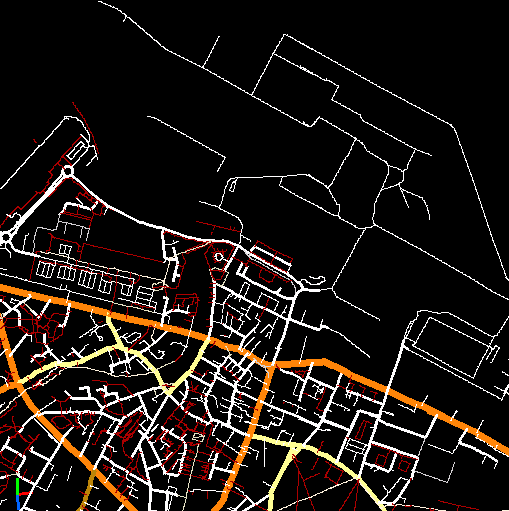

This project aims to produce a low-footprint, high performance C parser and vector tile render based on the Mapsforge format for OpenStreetMap.
Map loading is performed on discrete tiles, the demo app pieces multiple tiles together in each frame, as well as being subtile aware in order to further reduce memory footprint and only render what needs to be visible.

ESP32-C3             |  Hosted Demo
-------------------------|-------------------------
|

This was tested using a file generated using osmosis from raw OSM.PBF downloaded from geofabrik, configured to include only ways marked as highways, which reduces file-size by more than a factor of 10. This also makes the job of parsing the file substantially less complex. The parser currently ignores multipolygons.

Tiles in memory can be counted in hundreds to thousands of bytes, making this feasible to run on a low-cost microcontroller with a modest amount of SRAM, loading the map from an SD card using SPI, and drawing either to a framebuffer or directly to a LCD driver with embedded memory.

The renderer currently implemented also provides basic zoom and rotation capability.

TODO:
- [x] Implement on hardware. (ESP32-C3 Demo) 
- [ ] Seperate map load and rendering for greater flexibility.
- [ ] Break map loading up to enable file header to be maintained.
- [ ] Tile offset cache for nearby tiles to reduce seeking.
- [ ] Way ID cache, allow color schemes to be loaded from a file.

Initial tests were done on an STM32H7 and showed good performance, my goal is to try this on lower end hardware to see how simple the hardware for a GPS device enabled device could be made and display a map. I've now tested

